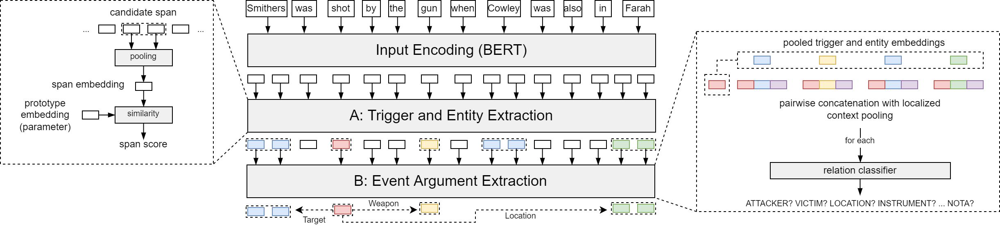

# DocEE - Document-level Event Extraction 



This repository contains the code for the bachelor thesis "Document-Level Event Extraction"

# Table of Contents
1. [Data](#data)
2. [Setup Dependencies](#dependencies)
3. [Reproducing Results (+ link to trained models)](#reproducing-results)
4. [Training](#training)


# Data
The WikiEvents task data can be found [here](https://github.com/raspberryice/gen-arg).
To use it with the code in this repo, place the raw training, dev, test (json-)files into the corresponding folders in the data directory.

# Setup
**Dependencies:**
- numpy (1.23.1)
- pandas (1.4.3)
- torch (1.12.0)
- transformers (4.20.1)
- tqdm (4.64.0)
- wandb (0.12.21)
- nltk (3.7)

Setup a virtual environment and install necessary dependencies by running the following lines of code:
```
python -m venv venv
source venv/bin/activate
python -m pip install --upgrade pip
pip install -r requirements.txt
```
**Preprocessing:**  
Make sure to place the raw train, dev, test (jsonl-) files in the corresponding folders, do not forget the coref folder. 
For creation of the Ontology files containing feasible roles, relation types and mention types, run preprocessing with --ont_files=True 

```
python preprocess.py --ont_files=True
```

# Checkpoints

We additionally provide model checkpoints, which are availabe [here](https://bwsyncandshare.kit.edu/s/49djSKD8eeZjQdH).

# Training
Example of training a model on the subtask of event argument extraction with shared roles:
```
python train.py --shared_roles=True --learning_rate=1e-5 --num_epochs=100 --batch_size=1 --random_seed=42
```

Example of training the same model on the full task :
```
python train.py --full_task=True --shared_roles=True --learning_rate=1e-5 --num_epochs=100 --batch_size=1 --random_seed=42
```

Please note, that the execution of the train.py file already includes the evaluation on the dev set after each epoch. The weights corresponding with the best run on the dev set are then saved as checkpoint and loaded for the evaluation on the test set at the end of the train.py file.

We additionally provide scripts, which can be run by the following command:
```
bash train_wikievents_subtask.sh

bash train_wikievents_fulltask.sh
```
